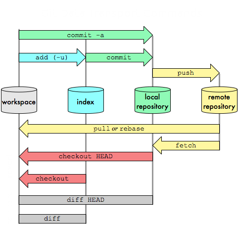

# 1. Conceptos básicos de Git

## 1.1. ¿Qué es Git?

Git es un **control de versiones distribuido** creado por [Linus Torvalds](https://www.cs.helsinki.fi/u/torvalds/) en 2005. 

Al utilizarlo para gestionar proyectos, las personas que trabajan en equipo (y también las que trabajan de forma individual) pueden almacenar sus proyectos de manera remota (en la nube) y, a su vez, tener una copia local en la que trabajar.

Guardar la información de forma remota posibilita que otras personas accedan a dicha información y se la descarguen, en caso de tener los permisos. A su vez, es en ese repositorio remoto donde cada miembro del equipo irá subiendo sus cambios para unificarlos con los del resto y, en caso de que algo le suceda a nuestra computadora, podemos estar tranquilos de que toda la información se encuentra respaldada allí.

## 1.2. ¿Qué es un control de versiones?

El control de versiones es un sistema que permite crear, modificar y eliminar archivos registrando cada uno de esos cambios en un historial, de manera tal que luego podamos revertir los cambios realizados, comparar distintas versiones del archivo en el que estamos trabajando  y cambiar entre ellas. 

Esto es posible porque cada versión de un archivo es registrada como la etapa en la que se encontraba ese proyecto en un momento del tiempo en particular.

Existen tres tipos de sistemas de contro de cambios (VCS, por sus siglas en inglés):

- **Control de versiones local:** guarda copias de las versiones de los archivos de manera local, en nuestra computadora. Desventaja: si la computadora se rompe o algo le sucede, perdemos nuestro trabajo.
- **Control de versiones centralizado (CVCS):** guarda copias de las versiones de los archivos en un servidor remoto. Las personas que estén trabajando en un mismo proyecto pueden conectarse a dicho servidor y así acceder a la versión que deseen y hacer sus modificaciones. Desventaja: si por alguna razón el servidor se cae o no tenemos acceso a él, no podremos trabajar.
- **Control de versiones distribuido (DVCS):** las copias de los archivos y su historial de cambios son guardados en un servidor remoto y, a su vez, cada miembro del equipo puede tener una copia de ellos guardada localmente.

## 1.3. ¿Git y GitHub son lo mismo?

No. Git es el sistema de control de versiones que nos permite hacer un seguimiento de nuestros archivos y gestionar sus versiones. GitHub es un servidor remoto al cual se conecta nuestra computadora cada vez que subimos (pusheamos) o bajamos (clonamos o pulleamos) información, entre otras cosas. Así como existe [GitHub](https://github.com/), existen otros servidores: [GitLab](https://about.gitlab.com/), [Bitbucket](https://bitbucket.org/product/), [SourceForge](https://sourceforge.net/), etc.

## 1.4. ¿Cómo funciona Git?

En Git, la información relacionada a nuestros archivos es manejada como una _copia instantánea_ de estos.Cada vez que se realiza un cambio en un proyecto, "se toma una foto" del estado de cada archivo en ese proyecto y se guarda la referencia. Para ser más eficiente, el sistema solo guarda nuevamente los archivos que se han modificado respecto de la última versión. Si un archivo no fue modificado, el sistema conserva la vieja versión que ya poseía almacenada.

### Los tres estados de Git

Git tiene tres estados principales en los que se pueden encontrar los archivos: 

- modificado (modified): significa que el archivo ha sido modificado pero todavía no se encuentra preparado para su confirmacion, no ha sido añadido al índice
- preparado (staged): significa que un archivo modificado ha sido marcado para que ser almacenado en la próxima confirmación
- confirmado (committed): significa que el archivo ha sido confirmado y, la próxima vez que se realice un push, se subirá al remoto. Aquí los datos están almacenados de manera segura en la base de datos LOCAL, pero todavía no se encuentran en la copia remota del repositorio (alojada en el servidor que se haya elegido).

De este modo, un proyecto de Git cuenta con tres secciones principales: 

- el directorio de Git (Git directory): donde se almacenan los metadatos y la base de datos de objetos para nuestro proyecto. Es la parte más importante de Git, y es lo que se copia cuando clonamos un repositorio desde la nube a nuestra computadora.

- el directorio de trabajo (working directory): copia de una versión del proyecto. Estos archivos se sacan de la base de datos comprimida en el directorio de Git, y se colocan en el disco para que los podamos usar o modificar.

- el área de preparación (staging area): es un archivo, generalmente contenido en nuestro directorio de Git, que almacena información acerca de lo que va a ir en nuestra próxima confirmación.

El **flujo de trabajo** básico en Git es algo así:-

- En nuestro directorio de trabajo tenemos una serie de archivos a los que les realizamos modificaciones. En esta instancia los archivos se encuentran **modificados**.

- Luego, los preparamos y los añadimos al área de preparación. Una vez hecho esto, los archivos están preparados o **staged**.

- Finalmente, confirmamos los cambios. Este paso toma los archivos tal y como están en el área de preparación y almacena esa copia instantánea de manera permanente en nuestro directorio de Git. Aquí se dice que los archivos fueron confirmados o **commiatedos**.

Hasta aquí hemos trabajado en forma local. Si bien hemos hecho cambios en nuestros archivos y los hemos confirmado, si vamos a nuestra página de de GitLab (o a la página del servidor que hayamos elegido para gestionar nuestros archivos), no veremos tales cambios en el repositorio remoto. Por el momento, nuestros últimos cambios se encuentran solamenten en nuestra computadora. Para subir estos cambios al remoto, lo que debemos hacer es _empujar_ los archivos al repo en la nube, esto es, **pushearlos** .

