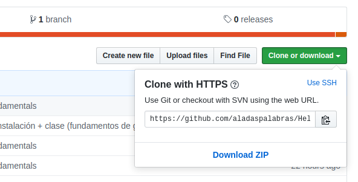

# 2. Primeros pasos: obtener un repositorio

Hay dos maneras de obtener un repositorio Git. La primera es clonar un repositorio existente en la nube. La segunda, tommar un proyecto o directorio existente en nuestra computadora e importarlo en Git. 

### 2.1. Descargar un repositorio existente

Para descargarnos o, más propiamente dicho, *clonarnos* un repositorio que ya existe en la nube, debemos ir a la página donde se ecuentre el repositorio en cuestión (GitHub, GitLab u otra de las existentes) y copiar su url utilizando el botón _Clone_:



Luego, abrimos desde terminal la carpeta donde deseamos descargar el repositorio y escribimos:

        $ git clone <url-copiada*>

Esto crea un directorio dentro de la carpeta con el mismo nombre que el repositorio clonado y con todos los subdirectorios necesarios para poder realizar el control de versiones de los archivos.

En caso de querer clonar un repositorio indicando un nombre distinto para el directorio a crear, se debe especificar dicho nombre de la siguiente manera:

       $ git clone <url-copiada> <nombre-del-directorio>
        
Ese comando hace lo mismo que el anterior, pero llama al directorio de destino bajo el nombre indicado en _<nombre-del-directorio\>_

### 2.2. Crear un repositorio nuevo

Supongamos que en nuestra computadora tenemos una carpeta con una serie de archivos que queremos importar a Git y empezar a seguir sus cambios. En ese caso, lo que debemos hacer es ir hasta esa carpeta y abrirla en una terminal. Una vez allí, escribimos:

        $ git init
        
Este comando lo que hará es crear un subdirectoio .git, dentro de nuestra carpeta, que contendrá todos los archivos necesarios del repositorio. Observar en particular que, si vamos al archivo _config_ ubicado en dicha carpeta, este no contiene información específica sobre el remoto al cual subiremos nuestros archivos, cuál es nuesto usuario o nuestro e-mail. Esto es porque el comando init solo inicializa la carpeta dándole los archivos que permitan armar la estructura necesaria para gestionar un repositorio. Nosotros ahora debemos especificar la información que requiere esa estructura.

Empezaremos indicando cuál será nuestro almacenamiento remoto. Para esto, iremos a nuestro repositorio en la nube y copiaremos su url desde el botón _Clone_ del mismo modo que se indica en el apartado [2.1.](#2.1.-Descargar-un-repositorio-existente)

        $ git remote add origin <url-copiada>

Si mientras hacemos esto vamos mirando el archivo _config_, podremos ver cómo se va agregando la información.

Del mismo modo, debemos indicarle a Git quiénes somos y cuál es nuestro correo electrónico. Esto puede hacerse con los siguientes comandos:

        $ git config --local user.name "nombre"
        
        $ git config --local user.email "email"
        
El flag --local indica que esa configuración solo es válida para el repositorio que se está utilizando en ese momento. Otros repositorios pueden tener otra configuración. En caso de querer utilizar el mismo nombre y correo electrónico en todos los repositorios que se tengan en la computadora, se debe cambiar el flag --local por --global.

**Aclaración:** No es necesario que el correo sea el mismo que está registrado en nuestro repositorio en la nube, ni que nuestro nombre sea el mismo que indicamos allí. Esta información solo es necesaria por cuestiones protocolares: cada vez que hacemos un commit, Git indica el nombre y el correo de quien lo hizo a fin de que, si alguien más lo necesita, pueda ponerse en contacto.

**Chequeando la información:**

Si queremos comprobar nuestra configuración, podemos usar alguno de los siguientes comandos:

        $ git config --list            # muestra toda la información disponible en config
        
        $ git config --get user.name   # muestra el nombre de usuario
                                       # puede cambiarse user.name por user.email para obtener el correo
                                       # o por remote.origin.url para obtener la url del remoto
                                       
        $ git remote -vv               # también muestra la url del remoto y su nombre asociado

Ahora, debemos agregar nuestro archivos contenidos en la carpeta al área de preparación o staging. Esto puede hacerse de varios modos:
 
         $ git add .
         
         $ git add -A
         
Tanto el punto como el -A indican que todos los archivos deben agregarse al staging. Sin en cambio se desea agregar solo algunos archivos, se puede cambiar el punto por el nombre específico del archvio (ej: git add <nomrbe-del-archivo\>).
    
Una vez preparados los arhcivos, es necesario confirmarlos. Esto se hace mediante el siguiente comando:
 
        $ git commit -m "Primer commit"
         
El _flag_ ```-m``` nos permite escribir un mensaje para el commit al mismos tiempo que ejecutamos el comando.
    
Si no s incluye este flag, no es posible escribir el mensaje en la misma línea. En ese caso, solo se escribe _git commit_ y la consola mostrará un editor que permita escribir un texto en más de una línea.
    

El paso anterior dejó nuestros archivos en nuestro repositorio local. Para subirlos al remoto debemos escribir:
 
        $ git push origin master
         
```origin``` es el nombre del remoto y ```master``` es el nombre de la rama. No siempre es necesario incluir esta información. Podemos configurar el repositorio y la rama a la que se debe hacer push por defecto utilizanod alguno de los siguientes comandos:

        $ git branch --set-upstream-to=<remote-branch>    # le indica a Git que la rama local en la que nos
                                                          # encontramos se sincroniza con la rama remota que 
                                                          # le indiquemos
        
        $ git push --set-upstream origin <remote-branch>  # le indica a Git que la rama local pushea desde la
                                                          # rama remota indicada

    
Si ahora volvemos a la página donde se encuentra nuestro repositorio remoto y le damos _refresh_, veremos que tiene los archivos que hemos subido.

### 2.2. Forkear un repositorio

TO-DO