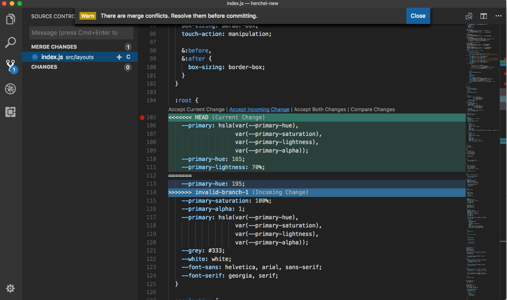

## 6. Merge

Supongamos que con une amigue estamos trabajando en el mismo repositorio y ambos estamos subiendo nuestros cambios al brazo ```master```. En este caso podría suceder que los dos nos pulleamos el brazo en el mismo momento y, mientras nuestro amigue hacía una modificación, nosotres también hacíanos una propia. Ahora bien, nuestro amigue pushea sus cambios y, cuando nosotres queremos pushear (previo haber hecho un ```add``` y un ```commit```) los nuestros, la consola nos diga que en el remoto hay cambios que no tenemos en nuestro repo local (¡claro! los de nuestro amigue). ¿Qué hacemos entonces? Hacemos un pull y nos descargamos los nuevos cambios.

Si las modificaciones que estaban en el remoto no afectaban a los mismos archivos que nosotres modificamos, no tendremos problemas. Simplemente nos saldrá un mensaje en nano indicando que se realiza un Merge (nosotres podemos cambiar ese mensaje) y podremos hacer el push.

Si, en cambio, tanto nuestro amigue como nosotres hicimos modificaciones en los mismos archivos, habrá conflictos y tendremos que solucionarlos. A continuación se explica cómo.

## 6.1. ¿Cómo saber si alguien más hizo cambios?

Los siguientes comandos nos dirán si hubo cambios en el remoto que no tenemos en el repositorio local

        $ git fetch <remote-name>/<branch-name>   # nos trae los cambios de la rama indicada del remoto
                                                  # para que podamos verlos, pero no los descarga a nuestro
                                                  # directorio de trabajo
        
        $ git fetch --all                         # ídem anterior pero con todas las ramas del remoto de todos
                                                  # los remotos (usarlo con cuidado)

Esto nos permite ver si hay cambios que puedan generar conflictos con los nuestros (porque modifican el mismo archivo, por ejemplo).
Si no hay cambios o si vemos que no resultan conflictivos, lo que debemos hacer es ejecutar los comandos ```add``` y ```commit``` de modo que nuestros cambios se guarden en el área de preparación. Una vez hecho esto, nos descargamos los cambios del remoto utilizando el comando ```pull``` y, finalmente, pusheamos nuestros cambios (solo pullear si hay cambios, si no los hay, luego de commitear, pushear directamente).

## 6.2. Cuando hay conflictos

Si no tomamos la precaución de controlar previamente que no hubiese conflictos o si la tomamos pero pensamos que era una buena idea resolverlos luego, tenemos que empezar a reflexionar sobre las decisiones que tomamos. Además, no vamos a llegar muy lejos porque, si hay conflictos, cuando queramos hacer el push de nuestros cambios, Git no nos va a dejar y nos va a pedir que resolvamos los conflictos existentes.

Si en este momento ejecutamos el comando ```git status```, veremos:

        $ git status

        On branch master
        You have unmerged paths.
          (fix conflicts and run "git commit")

        Unmerged paths:
          (use "git add <file>..." to mark resolution)

            both modified:      README

        no changes added to commit (use "git add" and/or "git commit -a")
        
Todo aquello que sea conflictivo y no se haya podido resolver, se marca como "sin fusionar" (unmerged). Git añade a los archivos conflictivos unos marcadores especiales de resolución de conflictos que nos guiarán cuando los abramos manualmente y los editemos para corregirlos. 

Lo mejor para esto es usar una interfaz visual del tipo de  [Visual Studio Code](https://code.visualstudio.com/). Allí, al abrir el archivo con conflictos veremos que contiene algo como:

```
<<<<<<< HEAD (Current Changes)
Mi repositorio en GitHub
=======
Mi primer repositorio en GitHub
>>>>>>> master (Incomming Changes)
```

Aquí se nos marca que la versión en HEAD contiene lo indicado en la parte superior del bloque  y que la versión entrante contiene el resto, lo indicado en la parte inferior del bloque. 

A modo de ilustración podemos ver la siguiente imagen:




Si queremos aceptar los cambios entrantes, simplemente debemos hacer click en el **+** en la esquina superior izquierda.
Si, en cambio, queremos dejar nuestros cambios, debemos ir a la opción **View>Command Palette** (también en Visual Studio Code) y, una vez allí, elegir la opción _Accept Current Change_. 

Una vez hecho esto, si ejecutamos el comando ```git status```, veremos:

        $ git status

        On branch master
        All conflicts fixed but you are still merging.
          (use "git commit" to conclude merge)

        Changes to be committed:

            modified:   README
            
Si todo ha salido correctamente, y vemos que todos los archivos conflictivos están marcados como preparados, podemos utilizar el comando ```commit``` para terminar de confirmar la fusión y luego pushear.